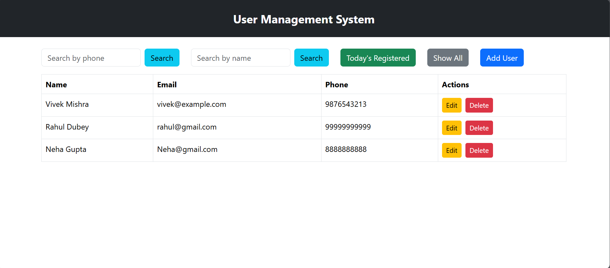
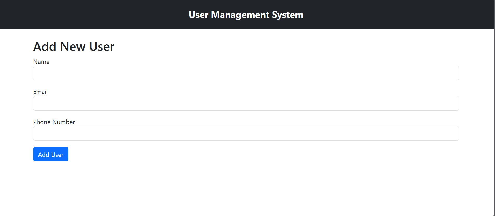
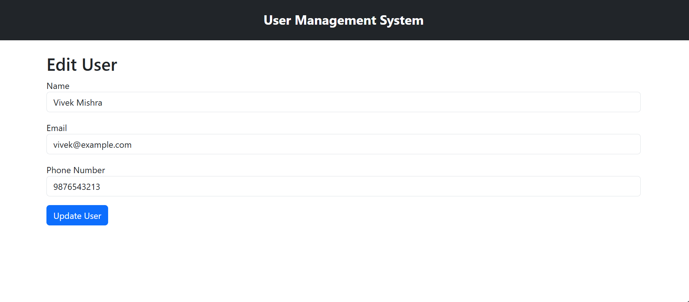

📋 User Management System (React + Java Spring Boot)

This is a User Management Web Application built with:
Frontend: React.js
Backend: Java Spring Boot (connected via REST APIs)
Database: MySQL

This is a User Management Web Application built with React for the frontend and connected to a backend Java Spring Boot via REST APIs. The app allows to search, filter, view, add, edit, and delete users, with features like "Search by phone", "Search by name", and "Today's registered users".

📦 Features
✅ View all registered users
✅ Search user by phone number
✅ Search user by name
✅ Filter users registered today
✅ Add new users
✅ Edit existing user details
✅ Delete a user
✅ Responsive design (Mobile-friendly UI)
✅ API-based data management with axios
✅ Dynamic routing using React Router

🧪 Functionalities Explained
1. Display Users
Fetches all users from backend using getAllUsers().
Displays users in a responsive table with actions for edit/delete.

3. Search By Phone
Input field to enter a phone number.
Calls the findByPhoneNumber() API.
If found, displays that specific user.

4. Search By Name
Input field to search by name.
Calls the findByName() API.
If found, displays that specific user.

5. Today’s Registered Users
Button that fetches users registered today using getTodayRegisteredUsers().

6. Add User
Navigates to /add route.
A form to enter name, email, and phone number.
On submission, sends data to backend and saves new user.

7. Edit User
Clicking edit opens /edit/:id page.
Pre-fills user data.
Allows updating user details and sends a PUT/PATCH request to backend.

8. Delete User
Deletes a user by ID using deleteUser().
🛠️ Tech Stack
Frontend: React, Bootstrap 5, React Router, Axios
Backend: java, Spring Boot
State Management: React useState, useEffect

📁 Project Structure
📂 src/
  ├── 📂 components/
  │     └── UserList.js          # Main list & search interface
  ├── 📂 services/
  │     └── userService.js       # API calls (CRUD)
  ├── App.js
  ├── index.js

🌐 Responsive UI
Designed with Bootstrap and Flexbox (d-flex, gap-2, table-responsive, etc.)
Works well on mobile screens (tested on same WiFi via IP)
🚀 Getting Started
1. Clone the repository
git clone https://github.com/VivekMishra21/user-management-app.git

cd user-management-app
2. Install dependencies
npm install
3. Start the React app (accessible on mobile via IP)
npm start
Make sure your mobile and computer are on the same Wi-Fi.

📡 API Endpoints Used

These are assumed API endpoints (adjust based on your actual backend):

Action	Endpoint	Method
Get all users	/users	GET
Find user by phone	/users/phone/{phone}	GET
Find user by name	/users/name/{name}	GET
Add user	/users	POST
Edit user	/users/{id}	PUT
Delete user	/users/{id}	DELETE
Today’s registered	/users/today	GET

🔧 Tech Stack
Layer	Technology
Frontend	React.js
Styling	Bootstrap 5
Backend	Spring Boot
State Handling	React Hooks
HTTP Client	Axios
Routing	React Router DOM

📷 Screenshots
| Desktop View |--------------|-------------| 

🙌 Author
Vivek Kumar Mishra

